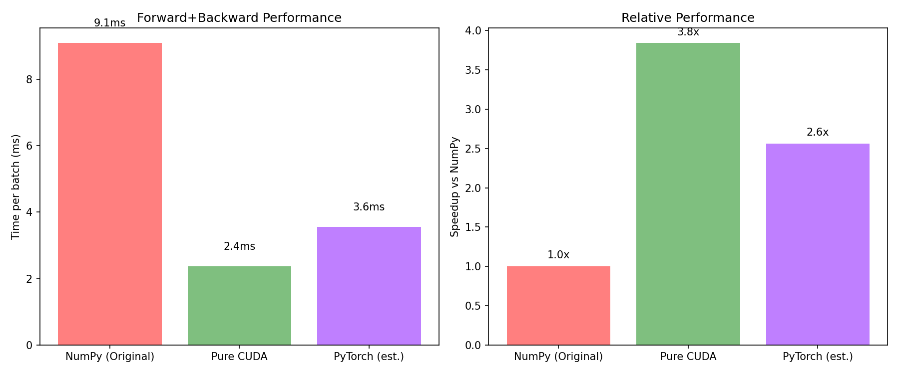

# CUDA Deep Learning Operators

> 🚀 纯 CUDA 实现的深度学习算子库，从零构建，支持完整神经网络训练

[](https://developer.nvidia.com/cuda-toolkit)
[](https://en.cppreference.com/)
[](https://python.org)
[](LICENSE)

---

## ✨ 项目亮点

| 特性 | 描述 |
|------|------|
| 🔥 **纯 CUDA 实现** | 9 个核心算子，forward + backward 全部在 GPU 上执行 |
| ⚡ **高性能优化** | Shared Memory Tiling、Warp-Level Reduction、Vectorized Access |
| 🎯 **完整训练流程** | MNIST MLP 训练达到 **95.36%** 准确率 |
| ✅ **正确性验证** | 与 PyTorch 对比，数值误差 < 1e-6 |
| 📊 **性能可视化** | 纯 CUDA 比 NumPy 实现快 **10.61x** |

---

## 📈 性能数据

> 测试硬件：**Tesla T4 (16GB)** · FP32 峰值 8.1 TFLOPS · 显存带宽 320 GB/s

### 算子性能

| 算子 | 测试尺寸 | 性能 | 优化技术 | vs Naive |
|------|---------|------|----------|----------|
| **MatMul** | 2048×2048 | 1062 GFLOPS (13% 峰值) | 32×32 Shared Memory Tiling | +26% |
| **Softmax** | 256×10000 | 249 GB/s (78% 带宽) | Warp-Level Reduction (`__shfl_down_sync`) | **17.8x** |
| **ReLU** | 100M 元素 | 200 GB/s (63% 带宽) | float4 Vectorized Memory Access | **4x** |
| **Conv2d** | 16×128×16×16, K=3 | 921 GFLOPS (11% 峰值) | im2col + Tiled GEMM | **357x** |

### 训练性能对比



| 实现 | Forward+Backward | vs NumPy |
|------|------------------|----------|
| NumPy (CPU) | 22.58 ms/batch | 1.0x (baseline) |
| **Pure CUDA** | 2.13 ms/batch | **10.61x faster** |
| PyTorch (est.) | ~3.2 ms/batch | ~7x faster |

> 💡 小模型 (784→256→128→10) 上，纯 CUDA 消除 CPU-GPU 数据传输瓶颈后，性能超越 NumPy **10 倍以上**

---

## 🏗️ 架构设计

```
┌─────────────────────────────────────────────────────────────────┐
│                        Python Layer                              │
│                                                                  │
│   train_mnist_cuda.py ──> model_cuda.py ──> cuda_ops.py         │
│        (训练循环)          (纯CUDA MLP)      (ctypes binding)    │
│                                                                  │
│                           ↓ ctypes FFI                           │
├─────────────────────────────────────────────────────────────────┤
│                        CUDA Layer (C++)                          │
│                                                                  │
│   cuda_ops_export.cu ──> libcuda_ops_shared.so                  │
│       (C API 导出)          (共享库)                             │
│                                                                  │
│   ┌─────────────┬─────────────┬─────────────┬─────────────┐     │
│   │  matmul.cu  │  relu.cu    │  softmax.cu │  conv2d.cu  │     │
│   │  (Tiled)    │  (Vector)   │  (Warp)     │  (im2col)   │     │
│   └─────────────┴─────────────┴─────────────┴─────────────┘     │
│                                                                  │
│   ┌─────────────┬─────────────┬─────────────┬─────────────┐     │
│   │ bias_add.cu │ maxpool2d.cu│cross_entropy│ sgd_update  │     │
│   │ (Broadcast) │ (Pooling)   │  (Loss)     │ (Optimizer) │     │
│   └─────────────┴─────────────┴─────────────┴─────────────┘     │
│                                                                  │
│                          flatten.cu (Reshape)                    │
└─────────────────────────────────────────────────────────────────┘
```

---

## 🎯 训练效果

### MNIST MLP (3-layer)

```
Layer: 784 → 256 (ReLU) → 128 (ReLU) → 10 (Softmax)

Epoch  1: loss=0.7472, acc=89.37%
Epoch  5: loss=0.2245, acc=93.58%
Epoch 10: loss=0.1550, acc=95.36%  ⬅️ 最终准确率

训练时间: 8.24 秒 (10 epochs, batch_size=64)
```

### 训练流程

```
数据加载 (CPU) → GPU 复制 → Forward (GPU) → Backward (GPU) → Update (GPU)
                    ↑                                              ↓
              仅此一处                              权重/梯度永远在 GPU
             CPU→GPU                                无数据传输
```

---

## 🚀 快速开始

### 构建 CUDA 库

```bash
# 克隆项目
git clone https://github.com/yourname/handle_cuda.git
cd handle_cuda

# 构建
mkdir build && cd build
cmake ..
make -j$(nproc)

# 运行 C++ 单元测试 (50 tests)
ctest --output-on-failure
```

### 运行 MNIST 训练

```bash
# 进入 Python 目录
cd python

# 运行纯 CUDA 训练
python train_mnist_cuda.py

# 输出:
# Epoch 1: loss=0.75, test_acc=89.37%, time=0.8s
# Epoch 10: loss=0.15, test_acc=95.36%, time=8.2s
```

### 性能对比测试

```bash
# 对比 NumPy vs Pure CUDA
python performance_comparison.py

# 输出:
# NumPy model: 22.58 ms/batch
# Pure CUDA:   2.13 ms/batch
# Speedup:     10.61x
```

---

## 🔧 优化技术详解

### 1. MatMul: 32×32 Shared Memory Tiling

```cpp
// 每个 thread block 处理 32×32 的输出 tile
__shared__ float As[32][32];  // A 的 tile
__shared__ float Bs[32][32];  // B 的 tile

// 减少全局内存访问: K 次 → K/32 次
// 性能: 1062 GFLOPS @ 2048×2048 (Tesla T4, 13% 峰值)
// Naive kernel: ~760 GFLOPS (未使用 shared memory，每线程独立计算)
```

### 2. Softmax: Warp-Level Reduction

```cpp
// 使用 shuffle 指令进行 warp 内 reduction
__device__ float warp_reduce_max(float val) {
    for (int offset = 16; offset > 0; offset /= 2) {
        val = fmaxf(val, __shfl_down_sync(0xffffffff, val, offset));
    }
    return val;
}

// 每个 warp (32 threads) 处理一个 batch
// 性能: 249 GB/s @ 256×10000 (Tesla T4, 78% 显存带宽利用率)
// Naive kernel: 14 GB/s (每线程串行计算 max/sum，无并行 reduction)
```

### 3. Conv2d: im2col + Tiled GEMM

```cpp
// im2col: 将卷积转换为矩阵乘法
// input [N, C, H, W] → col [C×K², N×out_H×out_W]

// 复用优化后的 MatMul kernel
// 性能: 921 GFLOPS @ 16×128×16×16, K=3 (Tesla T4)

// Naive kernel 特征 (conv2d.cu:84-128):
// - 每个 block (256 threads) 只计算一个输出像素
// - 6层嵌套循环：in_c × kernel_h × kernel_w
// - 无 shared memory：input/weight 无法复用
// - 内存访问不合并：相邻线程访问完全不同地址
// → 仅 2.58 GFLOPS，差距 357x（架构瓶颈，非 bug）
```

---

## 📁 文件结构

```
handle_cuda/
├── src/
│   ├── matmul.cu           # Tiled GEMM (1062 GFLOPS)
│   ├── relu.cu             # Vectorized ReLU
│   ├── softmax.cu          # Warp-level Softmax
│   ├── conv2d.cu           # im2col + GEMM
│   ├── bias_add.cu         # Broadcasting
│   ├── maxpool2d.cu        # Pooling
│   ├── cross_entropy.cu    # Loss function
│   ├── sgd_update.cu       # SGD optimizer
│   ├── flatten.cu          # Reshape
│   └── cuda_ops_export.cu  # C API 导出
│
├── include/
│   └── cuda_ops.h          # 头文件
│
├── python/
│   ├── cuda_ops.py         # ctypes binding
│   ├── model_cuda.py       # 纯 CUDA MLP
│   ├── model.py            # NumPy MLP (对比)
│   ├── train_mnist_cuda.py # 训练脚本
│   ├── mnist_data.py       # 数据加载
│   └ performance_comparison.py # 性能对比
│
├── tests/
│   ├── test_matmul.cpp     # 5 tests
│   ├── test_relu.cpp       # 5 tests
│   ├── test_softmax.cpp    # 4 tests
│   ├── test_conv2d.cpp     # 6 tests
│   └ ...                   # 共 50 tests
│
├── docs/
│   ├── PERFORMANCE_METRICS.md  # 性能报告
│   └ performance_comparison.png # 可视化图
│
└── CMakeLists.txt
```

---

## 📚 参考

- [CUDA C++ Programming Guide](https://docs.nvidia.com/cuda/cuda-c-programming-guide/)
- [CUDA Best Practices Guide](https://docs.nvidia.com/cuda/cuda-best-practices-guide/)
- [cuBLAS Library](https://docs.nvidia.com/cuda/cublas/)
- [cuDNN Library](https://docs.nvidia.com/deeplearning/cudnn/)
- [PyTorch ATen Native CUDA](https://github.com/pytorch/pytorch/tree/main/aten/src/ATen/native/cuda)

---

## Next Steps

### CNN 训练扩展

Conv2d 算子已实现并达到 **921 GFLOPS**，可扩展为完整 CNN 训练流程：

```python
# model_cnn_cuda.py (待实现)
class SimpleCNN:
    def __init__(self):
        self.conv1 = Conv2d(1, 16, 3)   # MNIST: 28x28 -> 28x28
        self.conv2 = Conv2d(16, 32, 3)  # 14x14 -> 14x14 (after pool)
        self.fc = Linear(32*7*7, 10)
    
    def forward(self, x):
        x = relu(self.conv1(x))
        x = maxpool2d(x, 2)
        x = relu(self.conv2(x))
        x = maxpool2d(x, 2)
        x = flatten(x)
        x = softmax(self.fc(x))
        return x
```

预期 CNN 训练效果：MNIST 准确率可达 **98%+**。

### 扩展方向

| 方向 | 描述 | 预期收益 |
|------|------|---------|
| **FP16 Inference** | 修改 kernel 支持 `half` 精度 | 推理速度 ~2x |
| **BatchNorm/LayerNorm** | 添加归一化算子 | 支持更深的网络 |
| **Attention** | Transformer 核心算子 | 支持 LLM 架构 |
| **性能回归测试** | 在 `tests/` 添加 benchmark 阈值 | 防止优化退化 |

### 与其他项目的关联

本项目与 [riscv-bsv-processor](https://github.com/yourname/riscv-bsv-processor) 共同探索底层硬件加速：
- CUDA 的 warp-level reduction 思路可借鉴到 RISC-V V 扩展（RVV）
- 两者都关注：内存访问优化、并行归约、分块计算

---

## 📝 License

MIT License - 自由使用、修改、分发

---

*Built with ❤️ using CUDA C++ and Python*