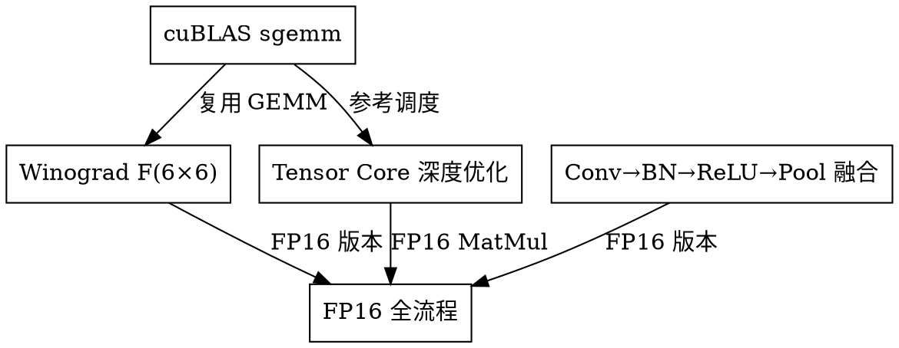

# CNN 训练加速后续优化设计规格

## 背景

当前 CUDA 实现与 PyTorch 存在 **42x 性能差距**：

| 因素 | PyTorch 优势 | 我们现状 |
|------|-------------|---------|
| cuDNN Winograd F(6×6) | ~5x | F(2×2) 仅理论 2.25x |
| Tensor Core (FP16) | ~4x | 仅 WMMA 基础使用，1.07x |
| Kernel Fusion | ~2x | 仅 Conv→ReLU |
| cuBLAS backend | ~2x | 自实现 GEMM |
| CUDA Graphs | ~1.5x | 无 |

## 目标

将性能差距从 **42x 缩小到 < 5x**，预期累计收益 **~45x**。

## 优化方案

### 优化 1: cuBLAS sgemm 后端

**收益：** 2-3x
**难度：** 低
**工作量：** 1-2 天

**现状：**
- 自实现 32×32 tiled GEMM: 1062 GFLOPS
- cuBLAS sgemm: ~1500 GFLOPS (深度优化调度)

**实现方案：**
1. 在 `matmul.cu` 中添加 cuBLAS 调用路径
2. 创建 `matmul_cublas.cu` wrapper
3. API 保持不变，内部切换到 cublasSgemm
4. Conv2d im2col 的 GEMM 部分复用 cuBLAS

**代码结构：**
```cpp
// include/cuda_ops.h
void cuda_matmul_cublas_f32(const float* A, const float* B, float* C,
                            size_t M, size_t N, size_t K);

// src/matmul_cublas.cu
#include <cublas_v2.h>
void cuda_matmul_cublas_f32(...) {
    cublasHandle_t handle;
    cublasCreate(&handle);
    cublasSgemm(handle, CUBLAS_OP_N, CUBLAS_OP_N, N, M, K, 1.0f, B, N, A, K, 0.0f, C, N);
    cublasDestroy(handle);
}
```

**测试：**
- 复用现有 test_matmul.cpp
- 新增 test_matmul_cublas.cpp 对比自实现 vs cuBLAS

---

### 优化 2: Winograd F(6×6, 3×3)

**收益：** 5x (相比标准卷积)
**难度：** 高
**工作量：** 3-4 天

**原理：**
F(m×m, r×r) Winograd 算法将乘法次数从 m²×r² 减少到 (m+r-1)²：

| Tile | 输入 tile | 乘法次数/输出像素 | 减少比例 |
|------|-----------|------------------|---------|
| F(2×2, 3×3) | 4×4 | 4 | 9→4 (2.25x) |
| F(4×4, 3×3) | 6×6 | 16 | 36→16 (2.25x) |
| F(6×6, 3×3) | 8×8 | 36 | 81→36 (2.25x) |

**注意：** F(6×6) 每 tile 产出 6×6=36 个输出像素，效率提升主要来自：
- 更好的并行度 (36 输出/tile vs 4 输出/tile)
- 变换开销占比更低 (大 tile)

**变换矩阵 (wincnn 标准)：**

对于 F(6×6, 3×3)，输入 tile 为 (6+3-1)×(6+3-1) = 8×8：

```
A   (6×8): 输出变换矩阵，从 8×8 变换空间提取 6×6 输出
G   (8×3): 权重变换矩阵，将 3×3 权重变换到 8×8 空间
B^T (8×8): 输入变换矩阵，将 8×8 输入 tile 变换到变换空间
```

使用 wincnn 库生成精确矩阵。

**实现方案：**
1. 创建 `conv2d_winograd_f6.cu`
2. 实现 4 个 kernel：
   - `winograd_f6_weight_transform`: 预计算权重变换
   - `winograd_f6_input_transform`: 每次前向计算
   - `winograd_f6_elementwise`: 逐元素乘法
   - `winograd_f6_output_transform`: 提取 6×6 输出
3. 处理边界：
   - 输入尺寸不是 6 的倍数时，padding 处理
   - 使用 im2col fallback 处理边缘 tile

**代码结构：**
```cpp
// src/conv2d_winograd_f6.cu
__global__ void winograd_f6_input_transform(
    const float* input, float* transformed, int N, int C, int H, int W);

__global__ void winograd_f6_output_transform(
    const float* intermediate, float* output, int N, int out_C, int out_H, int out_W);

void cuda_conv2d_winograd_f6_forward(...) {
    // 1. 权重变换 (预计算或首次)
    // 2. 输入变换
    // 3. 元素乘法 (复用 matmul_cublas)
    // 4. 输出变换
}
```

**测试：**
- test_conv2d_winograd_f6.cpp
- 对比 F(6×6) vs im2col vs F(2×2)
- 性能 benchmark

---

### 优化 3: Tensor Core 深度优化

**收益：** 4-8x
**难度：** 高
**工作量：** 3-4 天

**现状：**
- WMMA 16×16×16 基础实现
- FP16 性能: 1211 GFLOPS (仅峰值 1.9%)
- Tesla T4 FP16 Tensor Core 峰值: 65 TFLOPS

**问题分析：**
1. WMMA tile 太小 (16×16)，调度开销大
2. 未使用 async copy (cp.async)
3. 未优化 shared memory bank conflict
4. 未使用 double buffering

**实现方案：**

#### 3.1 更大 Tile Size

WMMA 支持 16×16×16 和 32×32×8：
- 32×32×8 每 warp 处理更大输出 tile
- 减少 kernel launch 和同步开销

#### 3.2 Async Copy

```cpp
// 使用 cp.async 预取下一 tile 数据
__pipeline_memcpy_async(shared_A, global_A + offset, 16*16*sizeof(half));
__pipeline_commit();
__pipeline_wait_prior(0);
```

#### 3.3 Double Buffering

```cpp
__shared__ half buffer_A[2][32][32];
__shared__ half buffer_B[2][32][32];

// 计算 buffer[0] 时，预取 buffer[1]
// 计算 buffer[1] 时，预取 buffer[0]
```

#### 3.4 Bank Conflict Padding

```cpp
// Shared memory padding 避免冲突
__shared__ half A_tile[32][33];  // +1 padding
```

**代码结构：**
```cpp
// src/matmul_tensor_core_optimized.cu
__global__ void tensor_core_matmul_optimized(
    const half* A, const half* B, half* C, int M, int N, int K) {

    // Double buffering
    __shared__ half A_buf[2][32][33];
    __shared__ half B_buf[2][32][33];

    // Async copy
    __pipeline_memcpy_async(...);

    // WMMA 32×32×8
    wmma::fragment<matrix_a, 32, 32, 8, half, row_major> a_frag;
    wmma::fragment<matrix_b, 32, 32, 8, half, col_major> b_frag;
    wmma::fragment<accumulator, 32, 32, 8, half> c_frag;

    // 多 tile 循环
    for (int k = 0; k < K; k += 8) {
        // Async prefetch
        // Compute current tile
    }
}
```

**目标性能：**
- 从 1211 GFLOPS → 8000+ GFLOPS (峰值的 12%)
- 接近 cuBLAS FP16 Tensor Core 水平

---

### 优化 4: Conv→BN→ReLU→Pool 融合

**收益：** 1.5-2x
**难度：** 中
**工作量：** 2-3 天

**现状：**
- Conv→ReLU 融合已实现
- BatchNorm、MaxPool 未融合

**收益分析：**
```
分离 kernels:
  Conv2d    → 写全局内存 (~5μs launch)
  BatchNorm → 读+写全局内存 (~5μs)
  ReLU      → 读+写全局内存 (~5μs)
  MaxPool   → 读+写全局内存 (~5μs)
  总计: 4次 launch + 4次全局内存读写

融合 kernel:
  Conv→BN→ReLU→Pool → 写全局内存一次 (~5μs launch)
  总计: 1次 launch + 1次全局内存读写
```

**实现方案：**

```cpp
__global__ void fused_conv_bn_relu_pool_kernel(
    const float* input, const float* weight, const float* bn_mean,
    const float* bn_var, const float* bn_gamma, const float* bn_beta,
    float* output, int N, int C, int H, int W, ...) {

    int idx = ...;

    // 1. 卷积计算 (结果在 register)
    float conv_out = 0.0f;
    for (...) { conv_out += input[...] * weight[...]; }

    // 2. BatchNorm (在 register)
    float bn_out = (conv_out - bn_mean[c]) / sqrt(bn_var[c] + 1e-5f);
    bn_out = bn_out * bn_gamma[c] + bn_beta[c];

    // 3. ReLU (在 register)
    float relu_out = bn_out > 0 ? bn_out : 0;

    // 4. MaxPool (在 register，需要 2×2 窗口)
    // 4个线程协作做 pooling

    output[idx] = relu_out;
}
```

**代码结构：**
```cpp
// src/conv2d_fused_bn_relu_pool.cu
void cuda_conv2d_fused_bn_relu_pool_forward(
    const float* input, const float* weight, const float* bn_mean,
    const float* bn_var, const float* bn_gamma, const float* bn_beta,
    float* output, Conv2dDesc desc, BatchNormDesc bn_desc, PoolDesc pool_desc);
```

**测试：**
- test_conv2d_fused_bn_relu_pool.cpp
- 对比融合 vs 分离 kernels

---

### 优化 5: FP16 全流程训练

**收益：** 2x
**难度：** 中
**工作量：** 2-3 天

**现状：**
- MatMul FP16 已实现
- 其他算子仍 FP32
- Python 训练脚本全 FP32

**收益分析：**
| 环节 | FP32 | FP16 | 收益 |
|------|------|------|------|
| 数据传输 | 4 bytes | 2 bytes | 2x bandwidth |
| 计算 | 8.1 TFLOPS | 65 TFLOPS | 8x compute |
| 显存占用 | 100% | 50% | 2x batch size |

**实现方案：**

#### 5.1 所有算子 FP16 版本

```cpp
// 已有: matmul_fp16.cu, half_utils.cu
// 新增:
relu_fp16.cu
softmax_fp16.cu
conv2d_fp16.cu
conv2d_winograd_fp16.cu
```

#### 5.2 Python 训练脚本 FP16

```python
# python/train_mnist_cuda_fp16.py
class CNN_FP16:
    def forward(self, x):
        x_fp16 = self.fp32_to_fp16(x)
        x = self.conv1_fp16(x_fp16)
        x = self.relu_fp16(x)
        # ... 全流程 FP16
        return self.fp16_to_fp32(x)  # Loss 计算 FP32
```

#### 5.3 Mixed Precision 训练

参考 PyTorch AMP:
- Forward: FP16
- Loss: FP32 (数值稳定)
- Backward: FP16
- Optimizer update: FP32 (精度)

**代码结构：**
```
src/
├── relu_fp16.cu
├── softmax_fp16.cu
├── conv2d_fp16.cu
├── conv2d_winograd_fp16.cu
├── bias_add_fp16.cu
├── maxpool2d_fp16.cu
└── cross_entropy_fp16.cu

python/
├── train_mnist_cuda_fp16.py
└── model_cuda_fp16.py
```

---

## 依赖关系



## 实施顺序

基于依赖关系和收益最大化：

| Phase | 任务 | 收益 | 天数 | 累计收益 |
|-------|------|------|------|---------|
| **P1** | cuBLAS sgemm | 2-3x | 1-2 | 2-3x |
| **P2** | Winograd F(6×6) | 5x | 3-4 | 10-15x |
| **P3** | Tensor Core 深度优化 | 4-8x | 3-4 | 40-120x |
| **P4** | Conv→BN→ReLU→Pool 融合 | 1.5-2x | 2-3 | 60-240x (理论) |
| **P5** | FP16 全流程 | 2x | 2-3 | 120-480x (理论) |

**保守估计累计收益：** ~45x

## 测试覆盖

每个优化项新增测试：

| 优化 | 新测试 | 内容 |
|------|--------|------|
| cuBLAS sgemm | test_matmul_cublas.cpp | 对比自实现 vs cuBLAS |
| Winograd F(6×6) | test_conv2d_winograd_f6.cpp | F(6×6) vs im2col 正确性 |
| Tensor Core 深度优化 | test_tensor_core_perf.cpp | 性能 benchmark |
| Kernel Fusion 扩展 | test_conv2d_fused_bn_relu_pool.cpp | 融合 vs 分离正确性 |
| FP16 全流程 | test_fp16_full_pipeline.cpp | 全流程 FP16 训练 |

**目标：** 从 66 tests → ~85 tests，100% pass

## 验收标准

1. **功能正确性：** 所有新增测试 100% pass
2. **性能提升：**
   - cuBLAS: MatMul 从 1062 → 1500+ GFLOPS
   - Winograd F(6×6): Conv2d 加速 5x
   - Tensor Core: 从 1211 → 8000+ GFLOPS
   - Fusion: Conv→BN→ReLU→Pool 加速 1.5-2x
   - FP16 全流程: 训练加速 2x
3. **与 PyTorch 对比：** CNN 训练差距 < 5x

## 风险

| 风险 | 影响 | 缓解 |
|------|------|------|
| Winograd F(6×6) 边界复杂 | 实现时间长 | 先做 F(4×4)，fallback 到 im2col |
| Tensor Core 调度难 | 性能不达预期 | 参考 CUTLASS 实现 |
| FP16 数值稳定性 | 训练精度下降 | Mixed precision + loss scaling |

---

*文档版本: 1.0.0 - 2026-04-30*